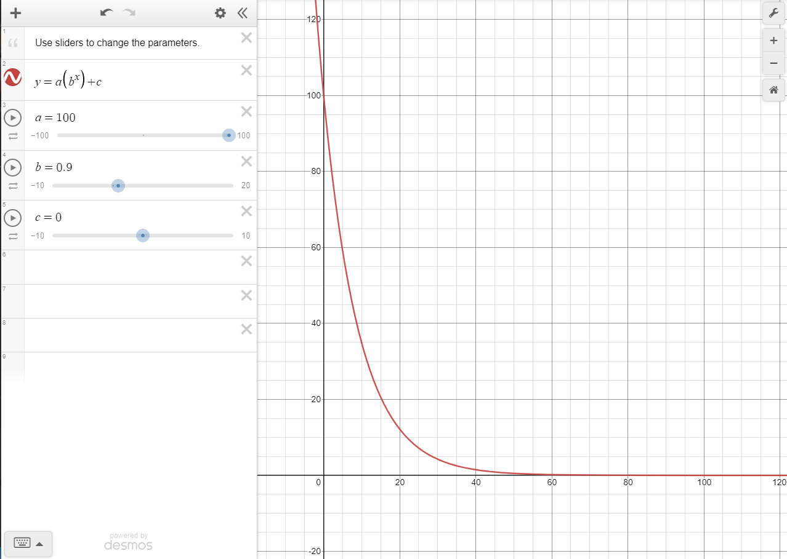

# underscore
Python script that pull assignment from Canvas (using Canvas integration api key) and prioritizes them based on:
- key words in description
- proximity to due date
  - calculated exponentially as due date approaches
    
- points possible


## Running Locally
### Prioritization Script
create a file called `.secrets` to hold your secrets:
```bash
export TOKEN=<canvas-integration-key>
export TEXT_ANYL_KEY=<azure-text-analysis-key>
export TEXT_ANYL_ENDPOINT="azure-text-analysis-endpoint-url"
```

to run script:
```bash
. .secrets

python -m venv venv
. venv/bin/activate
pip install -r requirements.txt

python script.py # 'python script.py > output.txt to output' to a text file
```

### Web App
flask environment variables
```bash
export FLASK_APP=project
export FLASK_DEBUG=1
```

create database for flask app (run in python REPL)
```python
from project import db, create_app, models
db.create_all(app=create_app()) # pass the create_app result so Flask-SQLAlchemy gets the configuration.
```

to start local development server
```bash
# run in app directory
flask run
```

## Useful Code Snippets
api call to get courses
```bash
curl -H "Authorization: Bearer $token" "https://canvas.instructure.com/api/v1/courses" | jq 
. > courses.json
```

api call to get assignments
```bash
curl -H "Authorization: Bearer $token" "https://canvas.instructure.com/api/v1/courses/$COURSE_ID/assignments" | jq . > assignments.json  
```